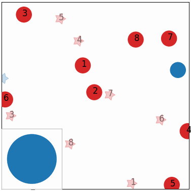

# Kurkova - Distance-Aware Errors for Kolmogorov Networks

This is the github repo for the paper ["K-DAREK: Distance-Aware Errors for Kolmogorov Networks"](https://). You may want to quickstart with [example](https://github.com/Masoud-Ataei/KDAREK/blob/main/KDAREK_Example.ipynb).

KDAREK is a method to compute **tight**, **distance-aware**, and **worst-case error bounds** for Kurkova - Kolmogorov-Arnold Networks (KKANs). Unlike probabilistic uncertainty estimation, KDAREK uses Lipschitz continuity of true functions to derive analytical bounds that increase with distance from training data. Please find the paper and other information here [here](https://Masoud-Ataei.github.io/KDAREK/index.html).
|  |  |
|:--:|:--:|
| Multi agent simulation when GP model fails. | Multi agent simulation when DAREK model reaches goal. |

## Installation
KDAREK can be installed directly from GitHub. 

**Pre-requisites:**

```
Python 3.9.7 or higher
pip
```

**For developers**

```
git clone https://github.com/Masoud-Ataei/KDAREK.git
cd DAREK
pip install -e .
```

**Installation via github**

```
pip install git+https://github.com/Masoud-Ataei/DAREK.git
pip install git+https://github.com/Masoud-Ataei/KDAREK.git
```

<!-- **Installation via PyPI:**
```
pip install pykan
``` -->

Requirements

```python
# python==3.9.7
# pykan==0.2.8
matplotlib==3.6.2
numpy==1.24.4
scikit_learn==1.1.3
setuptools==65.5.0
sympy==1.11.1
torch==2.2.2
tqdm==4.66.2
```

After activating the virtual environment, you can install specific package requirements as follows:
```python
pip install -r requirements.txt
```

**Optional: Conda Environment Setup**
For those who prefer using Conda:
```
conda create --name KDAREK-env python=3.9.7
conda activate DAREK-env
pip install git+https://github.com/Masoud-Ataei/KDAREK.git  # For GitHub installation
```

## Documentation
The documentation can be found [here](https://Masoud-Ataei.github.io/KDAREK/).

## Tutorials

**Quickstart**

Get started with [example.ipynb](./example.ipynb) notebook.

# Advices from KAN repository
## Advice on hyperparameter tuning
Many intuition about MLPs and other networks may not directy transfer to KANs. So how can I tune the hyperparameters effectively? Here is my general advice based on my experience playing with the problems reported in the paper. Since these problems are relatively small-scale and science-oriented, it is likely that my advice is not suitable to your case. But I want to at least share my experience such that users can have better clues where to start and what to expect from tuning hyperparameters.

* Start from a simple setup (small KAN shape, small grid size, small data, no reguralization `lamb=0`). This is very different from MLP literature, where people by default use widths of order `O(10^2)` or higher. For example, if you have a task with 5 inputs and 1 outputs, I would try something as simple as `KAN(width=[5,1,1], grid=3, k=3)`. If it doesn't work, I would gradually first increase width. If that still doesn't work, I would consider increasing depth. You don't need to be this extreme, if you have better understanding about the complexity of your task.

* Once an acceptable performance is achieved, you could then try refining your KAN (more accurate or more interpretable).

## Citation
```python
@inproceedings{ataei2025darek,
  title={KDAREK-Distance Aware Error for Kolmogorov Networks},
  author={Ataei, Masoud and Khojasteh, Mohammad Javad and Dhiman, Vikas},
  booktitle={ICSSC 2025-2025 },
  pages={1--5},
  year={2025},
  organization={IEEE}
}
```

## Contact
If you have any questions, please contact Masoud.Ataei@maine.edu
